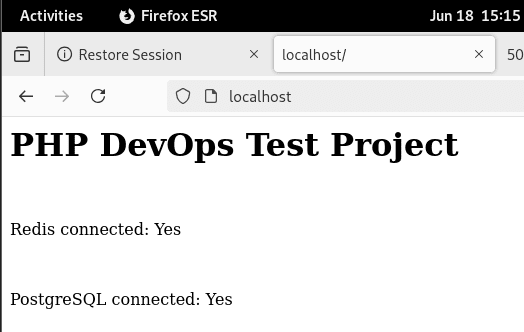
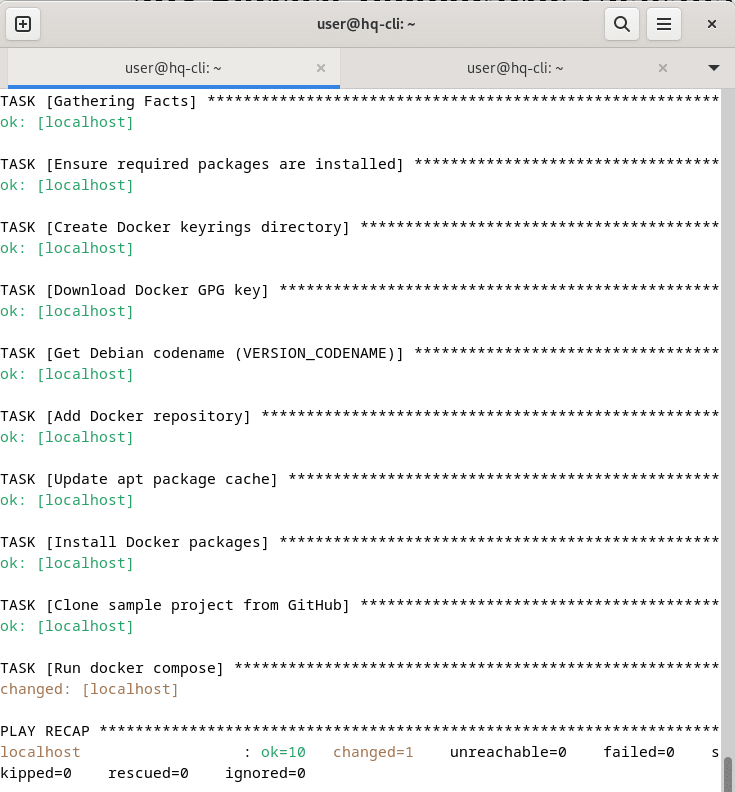
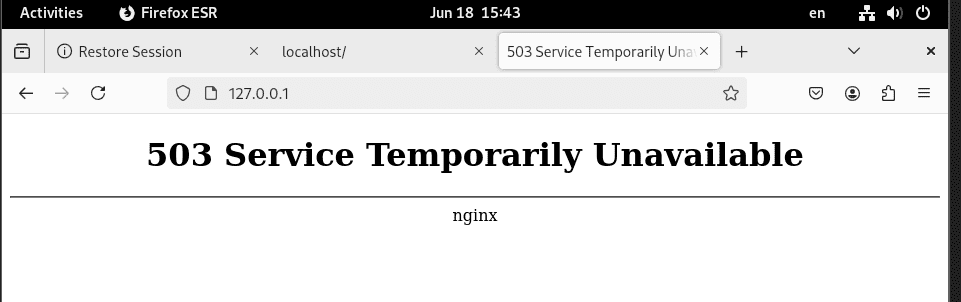

## 1. Настройка окружения в Docker

### docker-compose.yml

Это основной файл, который описывает всю инфраструктуру проекта:

#### 1. Сервис PostgreSQL

- Docker скачивает готовый образ PostgreSQL
- Используем теже переменные окружения что и у php-fpm
- Данные сохраняются в Docker volume (не исчезнут при перезапуске)
- Порт 5432 доступен для подключения

#### 2. Сервис Redis(кэш)

- Запускается Redis сервер
- Данные сохраняются в volume

#### 3. Сервис PHP-FPM

- Docker собирает PHP образ по нашим инструкциям в файле Dockerfile.php
- Наш index.php из папки `public` попадает в контейнер
- PHP-скрипт получает переменные окружения для подключений
- Контейнер запустится только когда БД и Redis будут готовы

#### 4.Сервис Nginx (веб-сервер)

- Nginx принимает запросы на порт 80
- Использует нашу конфигурацию nginx.conf для проксирования
- Имеет доступ к тем же файлам что и PHP

### Dockerfile.php

Инструктирует как правильно собрать контейнер

1. Берем готовый образ PHP 8.2 с FPM (FastCGI Process Manager) на основе Alpine Linux (легкий дистрибутив).
2. Устанавливаем системные пакеты:
   - `postgresql-dev` - для сборки расширения PostgreSQL
   - `autoconf, g++, make` - компиляторы для сборки расширений
   - `git, unzip` - нужны для работы Composer
3. Компилирует и устанавливает расширения PHP для работы с PostgreSQL.
4. Устанавливает расширение Redis через PECL (репозиторий расширений PHP).
5. Копирует Composer из официального образа в наш образ.
   - Устанавливает рабочую папку
   - Копирует файл зависимостей
   - Устанавливает PHP пакеты без интерактивных вопросов

### nginx.conf

Конфигурация веб-сервера

- Когда запрашивается .php файл, Nginx не выполняет его сам
- Отправляет запрос PHP-FPM процессу по адресу `php:9000`
- `php` - это имя сервиса из docker-compose

### composer.json

Менеджер зависимостей PHP

- Указывает что нашему PHP нужны расширения PDO и Redis. Composer проверит их наличие
- Настраивает автозагрузку классов (в данном проекте не используется, но хорошая практика).

### Как это все работает вместе

1. **Docker Compose читает docker-compose.yml**
2. **Создает сеть** для общения контейнеров между собой
3. **Запускает PostgreSQL и Redis** первыми
4. **Собирает PHP образ** по Dockerfile.php
5. **Запускает PHP-FPM** с нашим кодом
6. **Запускает Nginx** который принимает запросы

#### Поток запроса:

1. Браузер → `http://localhost` → Nginx (порт 80)
2. Nginx видит запрос к index.php → отправляет PHP-FPM (порт 9000)
3. PHP-FPM выполняет код → подключается к `redis:6379` и `db:5432`
4. PHP возвращает HTML → Nginx → браузер

#### Docker сеть:

- Контейнеры видят друг друга по именам (`redis`, `db`, `php`)
- Внутри контейнера `redis` доступен как `redis:6379`
- Снаружи PostgreSQL доступна как `localhost:5432`



### PHP DevOps Test Project - Краткая инструкция

#### Быстрый старт

1. **Создайте структуру проекта:**

   ```
   devops-test/
   ├── docker-compose.yml
   ├── Dockerfile.php
   ├── nginx.conf
   ├── composer.json
   └── public/
       └── index.php
   ```

2. **Запустите проект:**

   ```bash
   docker compose up -d
   ```

3. **Откройте в браузере:**

   ```
   http://localhost
   ```

#### Ожидаемый результат

- Redis connected: **Yes**
- PostgreSQL connected: **Yes**

#### Полезные команды

- **Остановить:** `docker compose down`
- **Перезапустить:** `docker compose restart`
- **Посмотреть логи:** `docker compose logs -f`
- **Пересобрать:** `docker compose build --no-cache`

## 3.Разработка Ansible-плейбука

Делаем таски по установке докера согласно документации. В моем случае, я проверял работоспособность на ОС Debian 12. https://docs.docker.com/engine/install/debian/#install-using-the-repository

В качестве гитхаб образа для теста взял образ проксирующего nginx. https://github.com/nginx-proxy/nginx-proxy

все таски выполняются и образ запускается на localhost




## 4.Мини-задача по bash

- Использует `nc` (netcat) для проверки порта с таймаутом 3 секунды
- Если порт доступен - выводит сообщение в консоль
- Если недоступен - выводит сообщение И записывает в файл `check_port.log` с временной меткой
- Принимает хост и порт как аргументы командной строки (по умолчанию localhost:22)

### Использование

```bash
# Сделать исполняемым
chmod +x check_port.sh

# Запуск с параметрами по умолчанию (localhost:22)
./check_port.sh

# Запуск с указанием хоста и порта
./check_port.sh google.com 80
./check_port.sh 192.168.1.1 22
```

### Пример лога

```
root@hq-cli:devops-test/4_bash_script# cat check_port.log
2025-06-18 14:46:35 - Порт 192.168.1.1:22 недоступен
```
